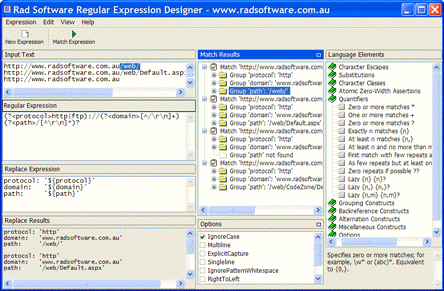

  <strong>Rad Software Regular Expression Designer </strong>is a free download
  that helps programmers learn, develop and test Regular Expressions. It is an
  interactive Windows application that is designed to be simple and easy to use.

<h2>Features</h2>

<ul>
  <li>
    The Regex match results are listed in a tree with levels for Matches, Groups
    and Captures. Clicking on a Match, Group or Capture will highlight it in the
    Input text window
  </li>
  <li>
    Regex.Replace is supported and the results of the replace are listed in a
    separate window.
  </li>
  <li>
    The Language Element window is an embedded reference that gets you up to
    speed quickly. Click on an item to see a description in the pane below,
    double-click a language element to add it to your Regex
  </li>
  <li>Find text in any of the text windows with Ctrl+F</li>
  <li>Flexible interface with dockable windows</li>
  <li>Now supports very large values for the input text</li>
</ul>

  

<h2>.NET Framework Required</h2>

  The Regular Expression Designer is requires the .NET Framework to be installed
  before it will run. The .NET Framework can be downloaded for free from
  Microsoft.

<h2>Download</h2>

  <a href="./Rad.RegexDesigner.Setup.1.4.exe">
   Download Rad Software Regular Expression Designer v1.4</a
  >
  (~209 KB)

  &nbsp;

  <form action="https://www.paypal.com/cgi-bin/webscr" method="post">
    <input type="hidden" name="cmd" value="_s-xclick" />
    <input type="hidden" name="hosted_button_id" value="HK78UK46GDQHA" />
    <input
      type="image"
      src="https://www.paypal.com/en_AU/i/btn/btn_donateCC_LG.gif"
      border="0"
      name="submit"
      alt="PayPal - The safer, easier way to pay online."
    />
    
  </form>

If you have found the Regular Expression Designer useful and you would like to
make a donation please use this PayPal button. 
 
The Regex Designer is free and there is no obligation to donate :-)

<h2>Updated to Version 1.4</h2>

  The Regular Expression Designer has been updated to v1.4. The changes include:

<ul>
  <li>
    Regex is run in another thread so long running expressions can be cancelled.
  </li>
  <li>Regular Expressions can be saved to a file and reloaded.</li>
  <li>
    A new installer program has been used. Will install on Windows vista (does
    not check .NET Framework version)
  </li>
</ul>

<h2>Getting started with the Regular Expression Designer<strong> </strong></h2>

<ol>
  <li>
    

      Start the Regular Expression Designer from the Desktop shortcut or from
      the Start Menu
    

  </li>
  <li>
    Arrange the windows by dragging a window by its title to the edge of the
    screen or on top of another window title
  </li>
  <li>
    Enter some text to test the Regex against in the
    <strong>Input Text</strong> window
  </li>
  <li>
    Enter a Regular Expression in the
    <strong>Regular Expression</strong> window
  </li>
  <li>
    Click on the <strong>Match Expression </strong>button or press
    <strong> F5 </strong>to run the Regular Expression against the Input Text
  </li>
  <li>Matches are listed in the Match Results window</li>
  <li>Click on a Match to highlight the match within the Input Text</li>
</ol>
<h2>Learn Regular Expression Syntax</h2>

  If you are not familiar with Regular Expressions see the article on this
  site: 
  
  <a href="/articles/regexlearnsyntax.aspx/">
    Learn Regular Expression (Regex) Syntax for .NET</a
  >

